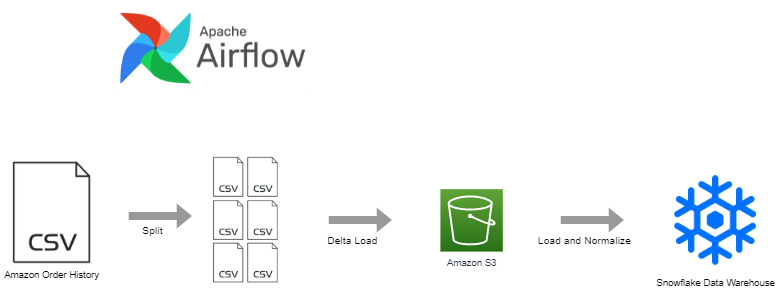

# Amazon Orders

This demo project incrementally loads a personal Amazon order history into a Snowflake data warehouse.

## Architecture




## Setup Airflow Locally using Docker

```bash
# Start Airflow
docker compose up airflow-init   # initialize the env, this command will return control when complete
docker compose up -d

# Shutdown Airflow
docker-compose down --volumes --remove-orphans
```

## Setup the Cloud Environment

First we need to generate an Amazon purchase history as the sample dataset.  This can be generated at the link below, but know that it will take 2-3 days for it to finish generate (why Amazon, why?!).

Next create an S3 bucket as a staging area for datasets.

https://www.amazon.com/gp/b2b/reports

### Step 1:  Create an S3 bucket

```bash
# Create s3 bucket to hold raw data
aws s3 mb s3://data-pipeline-practice-snowflake --region us-west-2
```

### Step 2:  Create IAM permission policy

The next few steps enable Snowflake to access files in S3 bucket.  This involves creating a specific IAM policy (this Step) and IAM role (Step 3).  This was adapted from the official Snowflake documentation here:

https://docs.snowflake.com/en/user-guide/data-load-s3-config.html

Create a permission policy for the role to use:

```bash
# Make sure to copy the policy ARN after it is created to use later
aws iam create-policy --policy-name snowflake_access --policy-document file://config/aws_s3_permission_policy.json --description "Allow authorized users to list, read from, and write to S3"
```

### Step 3:  Create IAM Role that Snowflake can assume

An IAM role needs two things: a **permission policy** (what resources can be accessed and what actions can be taken) and a **trust policy** (what actors/entites are allowed to assume the role).

```bash
# Create the IAM Role in AWS
aws iam create-role --role-name snowflake_role --assume-role-policy-document file://config/aws_role_trust_policy_1.json --description "Allows access for Snowflake to access data in S3 buckets"

# Attach the permission policy created in Step 2.  Replace the policy ARN value in <>.
aws iam attach-role-policy --role-name snowflake_role --policy-arn <value>
```

### Step 4:  Create a Snowflake storage integration

Run these commands from Snowflake

```sql
-- Must use the accountadmin role to create a Storage
USE ROLE accountadmin;
USE SCHEMA amazon_purchases.public;

-- Step 3: Create a Cloud Storage Integration in Snowflake
CREATE STORAGE INTEGRATION s3_integration
  TYPE = external_stage
  STORAGE_PROVIDER = s3
  ENABLED = true
  STORAGE_AWS_ROLE_ARN = '<IAM_ROLE_ARN>'
  STORAGE_ALLOWED_LOCATIONS = ('s3://data-pipeline-practice-snowflake/')
;

-- Step 4: Retrieve the AWS IAM User for your Snowflake Account
-- Record the following values: STORAGE_AWS_IAM_USER_ARN, STORAGE_AWS_EXTERNAL_ID
DESC INTEGRATION s3_integration;
```

### Step 5:  Modify IAM role to allow Snowflake to assume the role

First edit the `aws_role_trust_policy_2.json` file using the two values from the step above.  Then run this command:

```bash
aws iam update-assume-role-policy --role-name snowflake_role --policy-document file://config/aws_role_trust_policy_2.json
```

### Step 6:  Create an external stage

Assuming the above steps were successful, you should now be able to create an external stage to query files stored in S3.  See `dags/sql/00-init-data-model.sql` for an example.
